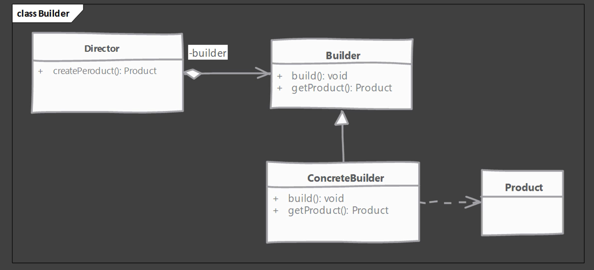
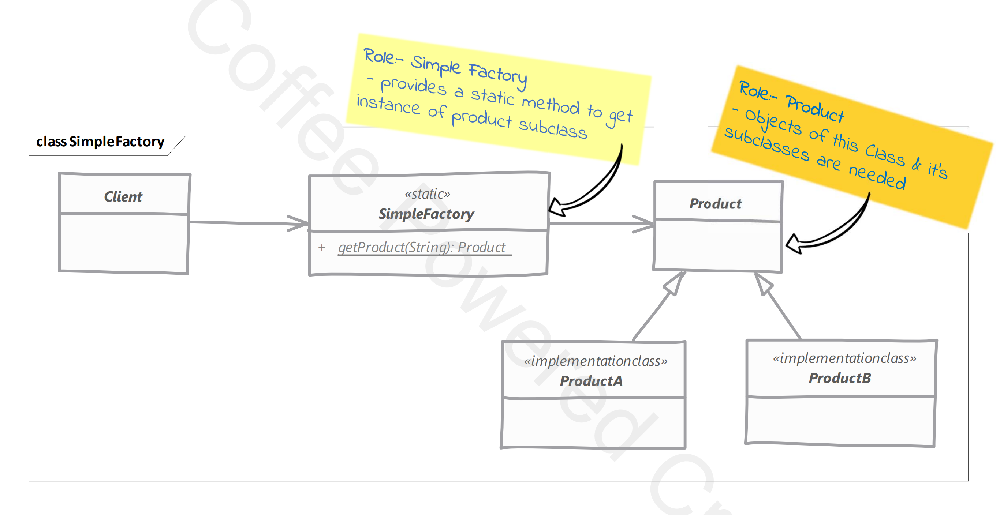
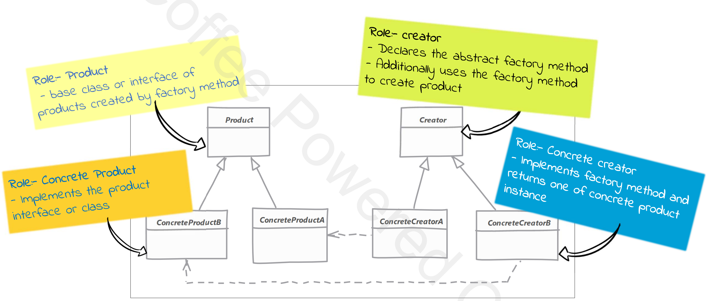
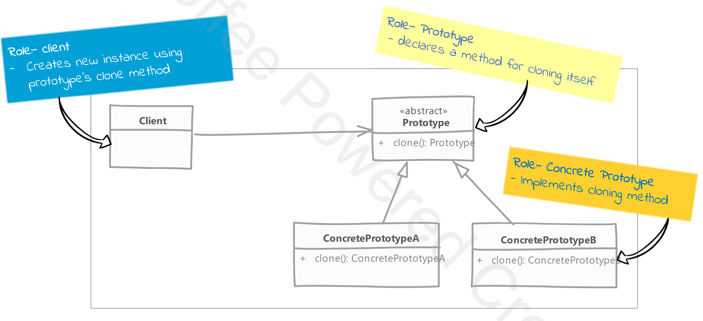
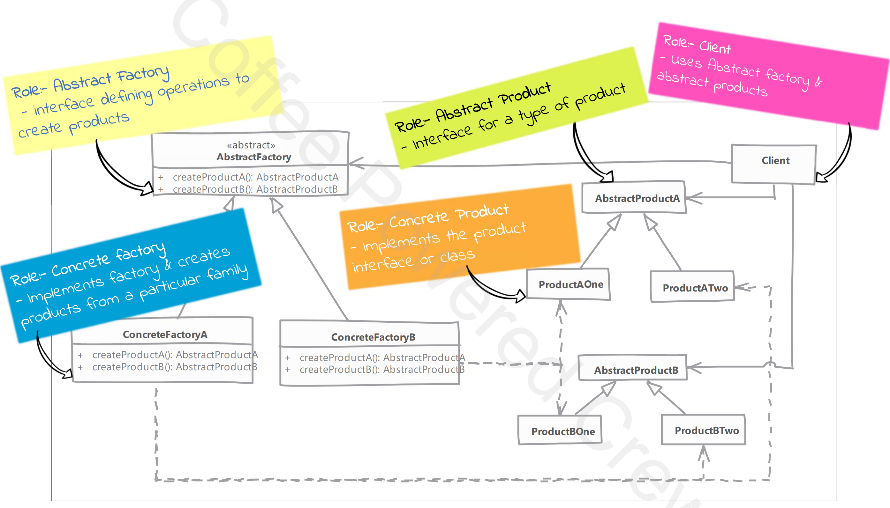
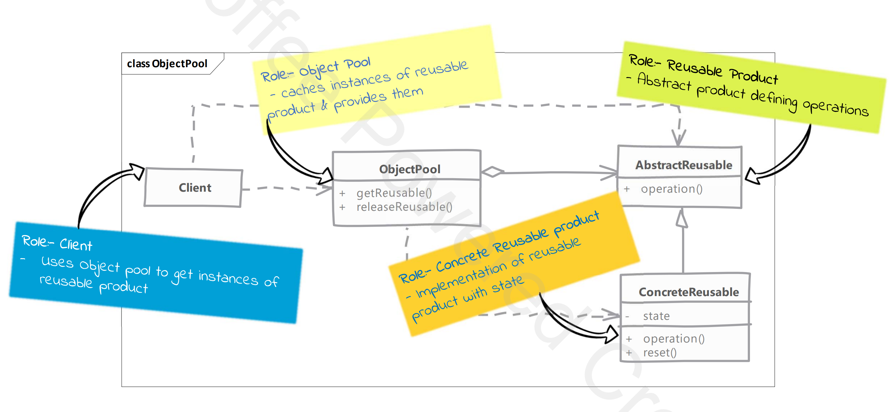

# Design Patterns

## SOLID Principles
- Single Responsibility Principle
- Open Closed Principle
- Liskov Substitution Principle
- Interface Segregation Principle
- Dependency Inversion Principle

### Single Responsibility Principle
* There should never be more than one reason for a class to change
* Reason for change:
  * For Rest service when request protocol changes, request body or response body changes, values of authentication changes or input field are changed
  
### Open Close Principle
* Software Entities(Classed, Methods, Modules etc.) should be open for extension, but closed for modification
  * Open for Extension: Extend existing behaviour (can derive from base class and override methods)
  * Close for Modification: Existing coe remain unchanged (avoid modifying the base class)

### Liskov Substitution Principle
* We should substitute base class objects with child class objects and this should not alter the behaviour/characteristics of program

### Interface Segregation Principle
* client should not be forced to depend upon interface that they do not use
* Interface Pollution:
  * Large Interface
  * Un-Related Methods
  * Class have Empty method implementation
  * Method implementation throws Unsupported Operation Exception (similar)
  * Method implementation returns NULL or default/dummy values

### Dependency Inversion Principle
* High-Level modules should not depend upon Low-Level modules, Both should depend upon Abstractions
* Abstraction should not depend upon details, details should depend upon abstraction

## Design Patterns Categories
- Creational Design Pattern
- Structural Design Pattern
- Behavioural Design Pattern

### Creational Design Pattern
- Builder
- Simple Factory
- Factory Method
- Abstract Factory
- Prototype
- Singleton
- Object Pool

#### Builder
- We have a complex process to construct an object involving multiple steps, then builder design patterns can help us
- In builder, we remove the logic related to object construction from 'client' code and abstract it in separate classes
- Steps: 
  * Identify the 'parts' of the product and provide method to create these parts
  * It should provide method to 'assemble' or build the product/object
  * It must provide way/method to get fully build object out. Optionally builder can keep reference to an product it has built so the same can be returned again in future

#### Simple Factory
- Here we simply move the instantiation logic to a separate class and most commonly to static method of this class
- Some do not consider Simple Factory to be a 'design pattern' as it is simply a method that encapsulate object instantiation
- Typically, we want to do this if we have more than one option when instantiating object and a simple logic is used to choose correct class
- We start by creating a separate class for our Simple Factory
  * This method is typically static and will accept some argument to decide which class to instantiate
  * You can also provide additional argument which will be used to instantiate objects

#### Factory Method
- We want to move object creation logic from our code to separate class
- We use this pattern when we do not know in advance which class we may need to instantiate beforehand and also to allow new classes to be added to system and handle their creation without affecting client code
- We let subclass decide which object to instantiate by overriding the factory method
- We start by creating a class for our creator
  * Creator itself can be concrete if it can provide a default object, or it can be abstract
  * Implementation will override the method and return an object

#### Prototype
- We have a complex object that is costly to create. To create more instance of such class, we use an existing instance as our prototype
- Prototype will allow us to make copies of existing object and save us from having to re-create object from scratch
- Prototype are useful when you have large object where majority of state is unchanged between instances, and you can easily identify that state
- A prototype registry is a class where in uou can register various prototypes which other code can access to clone out instance. This solves the issues of getting access to initial instance
- We start by creating a class which will be a prototype
  * The class ust be implement 'Cloneable' interface
  * Class should override clone method and return copy of itself
  * The method should declare 'CloneNotSupportedException' in throws clause to give subclass chance to decide on whether to support cloning
  * Clone method implementation should consider the deep and shallow copy and choose which ever is applicable

#### Abstract Factory
- Abstract factory is used when we have 2 or more object which togather forming a kit or set and there can be multiple sets or kit that can be created by client code
- Here we separate client code from concrete object forming such a set and also form the code which creates these sets
- Abstract factory make use of factory method pattern. You can think of abstract factory as an object with multiple factory methods
- Factories can be implemented as singleton, We typically ever need only one instance of it anyway
- Adding a new product type requires changes to the base factory as well as all implementation of factory
- We start by studying the product 'sets'
  * Create abstract factory as an abstract class of an interface
  * Abstract factory defines abstract methods for creating products
  * Provide concrete implementation of factory for each set of products

#### Singleton
- Singleton class has only one instance, accessible globally through a single point (via a method/field)
- Main problem this pattern solves is to ensure that only a single instance of this class exists
- Any state you add in your singleton becomes part of 'global state' of your application
- Controlling instance creation
  * Class constructor must not be accessible globally
  * Subclassing/Inheritance must not be allowed
- Giving access to the singleton instance
  * A public method is good choice
  * Can expose instance as 'final public static' field, but it won't work for all singleton implementation
- Two types
  * Early Initialization: Create singleton as soon as class is loaded
  * Lazy Initialization: Singleton is created when it is first required
- Singleton creation doesn't need any parameter. If you find yourself in need of support for construction arguments, you need simple factory or factory method

#### Object Pool
- In our system if cost of creating an instance of a class is high, and we need a large number of object of this class for short duration then we can use an object pool
- Here we either pre-create objects of the class or collect unused instance in memory cache. When code needs an object of this class we provide it from this cache
- The reusable object must be provided method to reset it state upon 'release' by code
- We have to decide whether to create new pool object when pool is empty or to wait until an object becomes available. Choice is influenced by whether the object is tied to a fixed number of external resource
- We start by creating class for object pool
  * A threadsafe caching of object should be cloned in pool
  * Method to acquire and release object should be provided and pool should reset cached object before giving them out.

