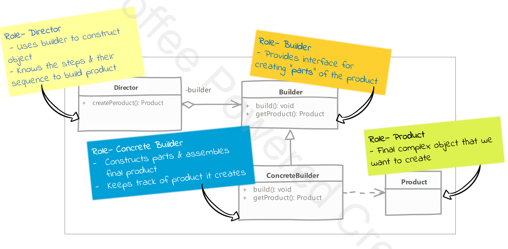

# Design Patterns

## SOLID Principles
- Single Responsibility Principle
- Open Closed Principle
- Liskov Substitution Principle
- Interface Segregation Principle
- Dependency Inversion Principle

### Single Responsibility Principle
* There should never be more than one reason for a class to change
* Reason for change:
  * For Rest service when request protocol changes, request body or response body changes, values of authentication changes or input field are changed
  
### Open Close Principle
* Software Entities(Classed, Methods, Modules etc) should be open for extension, but closed for modification
  * Open for Extension: Extend existing behaviour (can derive from base class and override methods)
  * Close for Modification: Existing coe remain unchanged (avoid modifying the base class)

### Liskov Substitution Principle
* We should substitute base class objects with child class objects and this should not alter the behaviour/characteristics of program

### Interface Segregation Principle
* client should not be forced to depend upon interface that they do not use
* Interface Pollution:
  * Large Interface
  * Un-Related Methods
  * Class have Empty method implementation
  * Method implementation throws Unsupported Operation Exception (similar)
  * Method implementation returns NULL or default/dummy values

### Dependency Inversion Principle
* High-Level modules should not depend upon Low-Level modules, Both should depend upon Abstractions
* Abstraction should not depend upon details, details should depend upon abstraction

## Design Patterns Categories
- Creational Design Pattern
- Structural Design Pattern
- Behavioural Design Pattern

### Creational Design Pattern
- Builder
- Simple Factory
- Factory Method
- Abstract Factory
- Prototype
- Singleton
- Object Pool

#### Builder
- We have a complex process to construct an object involving multiple steps, then builder design patterns can help us
- In builder we remove the logic related to object construction from 'client' code and abstract it in separate classes
- Steps: 
  * Identify the 'parts' of the product and provide method to create these parts
  * It should provide method to 'assemble' or build the product/object
  * It must provide way/method to get fully build object out. Optionally builder can keep reference to an product it has built so the same can be returned again in future

