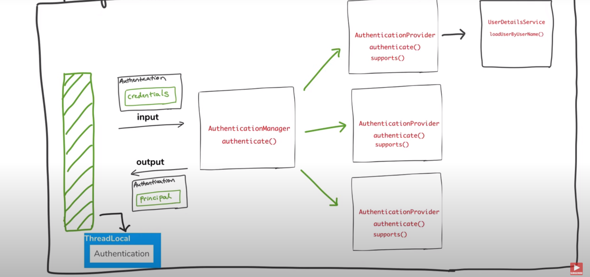
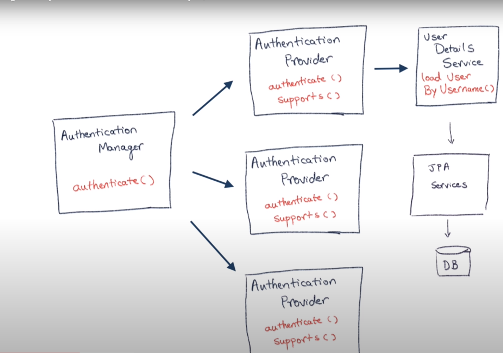
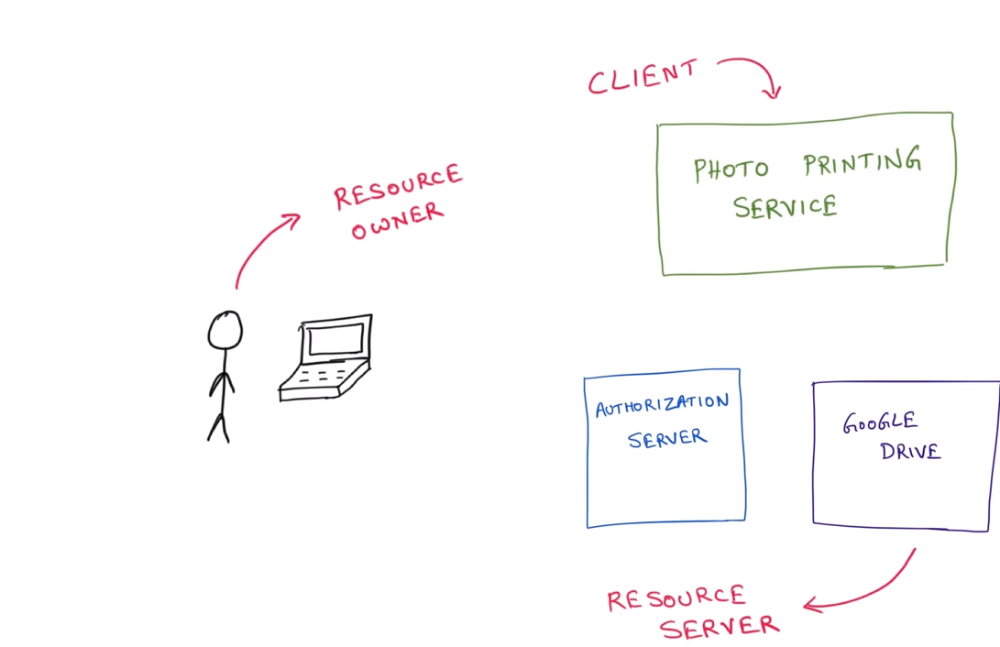

# Spring-Security

## Why Spring Security?
 1. Application Security framework
    * Login and Logout functionality
    * Allow/Block access to URLs to logged in users
    * Allow/Block access to URLs to logged in users and with certain roles  
 2. Handles common vulnerabilities
    * Session fixation
    * Clickjacking
    * Click site request forgrey
 3.  Widely adopted

## What Spring Security can do?
 1. Username / Password authentication
 2. SSO / OKta / LDAP
 3. App level Authorization
 4. Intra App Authorization like OAuth
 5. Microservices security (using tokens, JWT)
 6. Method level security

## 5 Core Concepts in Spring Security
 1. Authentication: Who is this user?
    * knowledge Based Authentication
      *  Providing Password , Pincode, Answer to a scret/ Personal question
      *  Easy to implement and use
      *  Not fully safe
    * Possession based Authentication 
      * Phone/ Text messages, Key cards and badges, Access token device 
    * Multi Factor Authentication
      * Combination of Knowledge based + Possession based authentication 
 2. Authorization: Are they allowed to do this?
 3. Principal: Currently logged in user
 4. Granted Authority
 5. Roles: Group of Authority

## Adding Spring Security to Spring Boot
 1. spring-boot-starter-security as a dependency pack in pom.xml
 2. Spring Security default behavior
    *  Adds mandatory authentication for URLs
    *  Adds login form
    *  Handles login error
    *  Create a user and set a default password

## Configure Authentication
 1. Create a class which should extends WebSecurityConfigurerAdapter
 2. Override the configure method and set auth object of AuthenticationManagerBuilder
 3. Enable security using annotate the class by @EnableWebSecurity 
 4. Set a password encoder by just expose a @Bean of type PasswordEncoder
   ```java
    @EnableWebSecurity
    public class SecurityConfiguration extends WebSecurityConfigurerAdapter {
        @Override
        protected void configure(AuthenticationManagerBuilder auth) throws Exception {

            auth.inMemoryAuthentication()
            .withUser("blah")
            .password("blah")
            .roles("USER")
            .and()
            .withUser("foo")
            .password("foo")
            .roles("Admin")
        }

        
    }

    @Bean
    public passwordEncoder getPasswordEncoder(){
        return NoOpPasswordEncoder.getInstance()
    }
   ```

## Configure Authorization
 1. Create a class which should extends WebSecurityConfigurerAdapter
 2. Override the configure method and set http object of HttpSecurity
 3. Specify the path and  give permission  
    ```java
        @Override
        protected void configure(HttpSecurity http) thorows Execption {
            http.authorizeRequests()
                .antMatchers("/admin").hasRole("ADMIN")
                .antMatchers("/user").hasAnyRole("USER", "ADMIN")
                .antMatchers("/").permitAll()
                .and().formLogin();
        }
    ```
## How Spring Authentication Works


## JDBC Authetication with Spring Security
 1. With Embedded  Database(h2)
    * Create table schema ie schema.sql
     ```sql
        create table users(
            username varchar_ignorecase(50) not null primary key,
            password varchar_ignorecase(50) not null,
            enabled boolean not null
        );

        create table authorities(
            username varchar_ignorecase(50) not null,
            authority varchar_ignorecase( 50) not null,
            constraint fk_authorities_user foreign key  (username) references users(username)
        );

        create unique index ix_auth_username on authorities (username, authorities);
     ```
    * Create data query ie data.sql
       ```sql
        INSERT INTO users (username, password, enabled)
            values('user','pass',true)

        INSERT INTO users (username, password, enabled)
            values('admin','pass',true)

        INSERT INTO users (username, password,enabled)
            values('user','pass',true)

        INSERT INTO authorities (username, authority)
            values('user','ROLE_USER');

        INSERT INTO authorities (username, authority)
            values('admin','ROLE_ADMIN');
       ```
    * Configure Authentication and Authorization
    ```java
        @EnableWebSecurity
        public class SecurityConfiguration extends WebSecurityConfigurerAdapter {

            @Autowired
            DatSource dataSource;
            @Override
            protected void configure(AuthenticationManagerBuilder auth) throws Exception {

                auth.jdbcAuthentication()
                    .dataSource(dataSource)
                    .usersByUsernameQuery("select username, password, enabled from users where username = ?")
                    .authoritiesByUsernameQuery("select username, authority from authorities where username = ?")
            }

            @Bean
            public passwordEncoder getPasswordEncoder(){
                return NoOpPasswordEncoder.getInstance()
            }

            @Override
            protected void configure(HttpSecurity http) thorows Execption {
                http.authorizeRequests()
                    .antMatchers("/admin").hasRole("ADMIN")
                    .antMatchers("/user").hasAnyRole("USER", "ADMIN")
                    .antMatchers("/").permitAll()
                    .and().formLogin();
            }
        }
    ```

## SpringBoot with Spring Security with  JPA authentication and MySql 



1. Create a Resource class for routing path
2. Create Security class for adding spring security ie configure Authentication and Authorization. For configure Authentication create UserDetailsService and Implemnts in another class, which has UserDetails method override it by implements it in another class(JPA class and its implemtation). 
3. Create a JPA implemts class ie structure of db. ie entity
4. Create JpaRepository interface ie defination for fetching data
5. Create password encoder in security method
6. Enable jPA by adding @EnableJpaRepositories notation in main class method
7. Spring Jpa needs to know extenal database information ie add it in application.property
   
   * SpringSecurityJpaApplication.java
       ```java
       @SpringBootApplication
       @EnableJpaRepositories(basePackageClassess = UserRespository.class)
       public class SpringSecurityJpaApplication{
           public static void main(String[] args){SpringApplication.run(SpringSecurityJpaApplication.class)}
       }
       ```
   * application.properties
       ```application.properties
       spring.datasource.url=jdbx:mysql://localhost:3306/springsecurity
       spring.datasource.username=root
       spring.datasource.password=password
       spring.jpa.hibernate.ddl-auto=update
       spring.jpa.hibernate.naming-stratergy=org.hibernate.cfg.ImprovedNamingStrategy
       spring.jpa,properties.hibernate.dialect=org.hibernate.dialect.MySQL%Dialect
       ```
   * MyUserDetailsService.java
       ```java
       @Service
       public class MyUserDetailsService implements UserDetailsService {

           @Autowired
           userRepository userRepository;

           @Override
           public UserRetails loadUserByUsername(String userName) throws UsernameNotFoundException {
               Optional<User> user = userRepository.findByUserName(userName);

               user.orElseThrow( -> new UsernameNotFoundException("Not found: " + userName));

               return user.map(MyUserDetails::new).get()
           }
       }
       ```
   * MyUserDetails.java
       ```java
           public class MyUserDetails implements userDetails {

               private String username;
               private String password;
               private boolean active;
               private List<GrantedAuthority> authorities;

               public MyUserDetails(User user){
                   this.userName = user.getUserName();
                   this.password = user.getPassword();
                   this.active = user.isActive();
                   this.authorities = Arrays.stream(user.getRole().split(","))
                       .map(SimpleGrantedAuthority::new)
                       .collect(Collectors.toList());
               }

               @Override
               public Collection<? extends GrantedAuthority> getAuthorities(){
                   return authorities;
               }

               @override
               public String getPassword(){
                   return password
               }
               
               @override
               public String getUsername(){
                   return username
               }

               
               @override
               public boolean isAccountNonExpired(){
                   return true
               }

               @override
               public boolean isAccountNonLocked(){
                   return true
               }

               @override
               public boolean isCredentialNonExpired(){
                   return true
               }

               @override
               public boolean isEnabledd(){
                   return true
               }

           }
       ```
   * User.java
       ```java
           @Entity
           @Table(name="User")
           public class user {
               @Id
               @GeneratedValue(strategy = Generationtype.AUTO)
               private int id;
               private String userName;
               private String password;
               private boolean active;
               private String roles;

               <Getters and Setters>
           }
       ```

   * SecurityConfiguration.java
     ```java
           @EnableWebSecurity
           public class SecurityConfiguration extends WebSecurityConfigurerAdapter {

               @Autowired
              UserDetailsService userDEtailsService ;

               @Override
               protected void configure(AuthenticationManagerBuilder auth) throws Exception {

                   auth.userDetailsService(userDetailsService)
               }

               @Bean
               public passwordEncoder getPasswordEncoder(){
                   return NoOpPasswordEncoder.getInstance()
               }

               @Override
               protected void configure(HttpSecurity http) thorows Execption {
                   http.authorizeRequests()
                       .antMatchers("/admin").hasRole("ADMIN")
                       .antMatchers("/user").hasAnyRole("USER", "ADMIN")
                       .antMatchers("/").permitAll()
                       .and().formLogin();
               }
           }
       ```
   * HomeResources.java
       ```java
           @REstController
           public class HomeResource {

               @GetMapping("/")
               public String home(){
                   return ("<h1>Welcome</h1>")
               }

               @GetMapping("/user")
               public String user(){
                   return ("<h1>Welcome User</h1>")
               }

               @GetMapping("/admin")
               public String admin(){
                   return ("<h1>Welcome Admin</h1>")
               }
           }
       ``` 

## Spring Boot and Spring Security auth with LDAP 
 1. Add LDAP dependencies in pom.xml ie unboundid-ldapsdk, spring-ldap-core, spring-security-ldap
 2. Add embedded ldap info in application.properties ie port, ldif(ladp data interchangeble format https://www.baeldung.com/spring-security-ldap),base
 3. Create a Resource class for routing path
 4. Configure spring security

* SecurityConfiguration.java
     ```java
           @EnableWebSecurity
           public class SecurityConfiguration extends WebSecurityConfigurerAdapter {

               @Override
               protected void configure(AuthenticationManagerBuilder auth) throws Exception {

                   auth.ldapAuthentiation()
                    .userDnPatterns("uid={0},ou=people")
                    .groupSearchbase("ou=groups")
                    .contextSource()
                    .url("ladap://localhost:8389/dc=springframework, dc=org")
                    .and()
                    .passwordCompare()
                    .passwordEncoder(new LdapShaPasswordEncoder())
                    .passwordAttribute("userPassword")
               }

               @Override
               protected void configure(HttpSecurity http) thorows Execption {
                   http.authorizeRequests()
                       .anyRquest().fullyAuthenticated()
                       .and().formLogin();
               }
           }
       ```

## JWT in SpringBoot
 1. Add JWT dependencies in pom.xml ie io.jsaonwebtoken:jjwt and javax depency ie javax.xml.bind:jaxb-api
 2. Create jwt util class  that conatian jwt creation and validation method
 3. Create authenticate api which takes input ie username and password  which returns token
 4. Create a security configurer and disable cross site request fordgerry and authorize request by '/authenticate' creted by us ie request mapping 
 5. Create filter class JwtRequestFilter ithat takes token from header and  and verifies it

* MyUserDetailsService.java
  ```java
    @Service
    public class MyUserDetialsService implements UserDetailsService {

        @Override
        public UserDetails loadUserByUsername (String userName) throws UsernamenotFoundException {
            return new User("foo", "foo", new ArrayList<>());
        }
    }
  ```
* SecurityConfigurer.java
   ```java
        @EnableWebSecurity
        public class SecurityConfiguration extends WebSecurityConfigurerAdapter {

            @Autowired
            private MyUserDetailsService myUserDetailsService;

            @Override
            protected void configure(AuthenticationManagerBuilder auth) throws Exception {
                auth.userDetailsService(myUserDetailsService)
            }

            @Override
            protected void configure(HttpSecurity http) thorows Execption {
                http.csrf().disable()
                .authorizeRequests().antMatchers("/authenticate").permitAll().anyRequest().authenticated();
            }

            @Override
            @Bean
            public AuthenticationManager authenticationMangerBean() throws Exception {
                return super.authenticationManagerBean()
            }

            @Bean
            public PasswordEncoder passwordEncoder() { return NoOpPasswordEncoder.getInstance();}
        }
    ```
* HelloResource.java
  ```java
    @RestController
    public class HelloResource {

        @Autowired
        private AuthentiationManager authenticationManger;

        @Autowired
        private MyUserDetailsService userDetailsService;

        @Autowired
        private JwtUtil jwtTokenUtil;

        @RequestMapping("/hello")
        public String hello(){ return "Hello World"}

        @RequestMapping(value="/authenticate", method=RequestMethod.POST)
        public ResponseEntity<?> creeateAuthenticationToken(@RequestBody AuthenticationRequest authenticationRequest) throws Exception{
            try{
                authenticationManger.authenticate(new UsernamePasswordAuthenticationToken(authenticationRequest.hgetUsername(), authenticationRequest,getPassword()));
            }catch (BadCredentialsEcxception e){
                throw new Exception("incorrect username or password", e)
            }

            final UserDetails userDetails = userDetailsService.loadUserByUsername(authincationRequest.getUsername());

            final String jwt = jwtTokenutil.genrateToken(userDetails);

            return ResponseEntity.ok(new AuthenticationResponse(jwt))
        }
    }
  ```
* JwtRequestFilter.java
    ```java
        @Component
        public class JwtRequestFilter extends OncePerRequestFilter {
            @Autowired
            private MyYserDetailsService userDetailsService;

            @Autowired
            private JwtUtil jwtUtil;

            @Override
            protected void doFilterInternal(HttpServletRequest request, HttpServletResponse response, FilterChain chain) throws ServletException, IOException {
                final String authorizationHeader = request.getHeader("Authorization");

                String username = null;
                String jwt = null;

                if(autorizationHeader != null && authorizationHeader.startsWith("Bearer ")){
                    jwt = authorizationHeader.substring(7);
                    username = jwtUtil.extractUsername(jwt);
                }

                if(username != null && SecurityContextHolder.getContext().getAuthentication() == null){
                    UserDetails userDetails = this.userDetailsService.loadUserByUsername(username);

                    if(jwtUtil.validateToken(jwt, userDetails)){

                        UsernamePasswordAuthenticationToken usernamepasswordAuthenticationToken = new UsernamePasswordAuthenticationToken(userDetails, null, userDetails.getAuthorities());

                        usernamePasswordAuthenticationToken.setDetails(new WebAuthenticationDetailsSpurce().buildDetails(request));

                        SecuritycontextHolder.getContext().setAuthentication(usernamePasswordAuthenticationToken)
                    }
                }
            }
        }
    ```
* AuthenticationRequest.java
    ```java
        public class AuthenticationRequest{

            private String username;
            private String passsword;

            public AuthenticationRequest(){

            }

            public AuthenticationRequest(String username, String password){
                this.username = username;
                this.password = password;
                
            }

            <Getters and Setters>
        }
    ```
* AuthenticationResponse.java
    ```java
        public class AuthenticationResponse{

            private final String jwt;

            public AuthenticationRespnset( String jwt){
                this.jwt = jwt
            }

            public String getJwt(){
                return jwt
            }
        }
    ```

* JwtUtil.java
    ```java
        @Service
        public String SECRET_KEY = "secret";

        public String extractUsername(String token){
            return extraxtClaim(token, Claims::getSubject);
        }

        public String extractExpiration(String token){
            return extraxtClaim(token, Claims::getExpiratiion);
        }

        public <T> T extractClaim(String token, Function<Claims, T> claimsResolver){
            final Claims claims = extractAllClaims(token);
            return claimsResolver.apply(claims)
        }

        private Claims extractAllClaims(String token){
            return Jwts.parser().setSognongKey(SECRET_KEY).parseClaimsJws(token).getBody();
        }

        private Boolean isTokenExpired(String token){
            return extraExpiration(token).before(new Date());
        }

        public String generateToken(UserDetails userDetails){
            Map<String, Object> claims = new HashMap<>();
            return createToken(claims, userDetails.getUsername());
        }

        private String createToken(Map<String, Object> claims, String subject){
            return Jwts.builder().setClaims(claims).setSubject(subject).setIssuedAt(new Date(system.currentTimeMillis()))
            .setExpiration(new Date(System.currentTimeMillis() + 1000 * 60 *60 * 10))
            .signWith(SignatureAlgorithm.HS256, SECRET_KEY).compact();
        }

        public Boolean validateToken(String token, userDetails userDetails){
            final String username = extractUsername(token);
            return (username.equals(userDetails.getUsername()) && !isTokenExpired(token))
        }
    ```
## OAuth
 1. Resource:
 2. Resource Owner: an entiry capable of granting access to a protected resource
 3. Resource Server : The server hosting the prtected resources
 4. Client: An application ,aking protected resource requests on behalf of the resource owner and with its authorization
 5. Authorization Server: The server issuing access tokens to the client


## OAuth for Authentication!!!
    OAuth is basically designed for authorization. But we can use it for a
    Authentication via some famous application like faceebook or github

    1. Add OAuth Authentication dependencies in pom.xmlie org.springframework.security.oauth.boot: spring--security-oauth2-autoconfigure
    2. Enable Oauth Authentication in springboot application by adding annotation in main class ie @EnableOauth2Sso
    3. Create a application in facebook or gitlab ie go to https://developers.facebook.com 
    4. Add application infomation in application.properties or application.yaml file ie
```yml
    security:
        oauth2:
         client:
            clientId: bd1c0a783cc********
            clientSecret: 129030********
            accessTokenUri: https://github.com/login/oauth.access_token
            userAuthorizationUri: https://github.com/login/oauth/authorize
            clientAuthenticationSchema: form
            tokenName: oauth_token
            authenticationSchema: query
        resource:
            userInfouri: https://api.girhub.com/user

```
