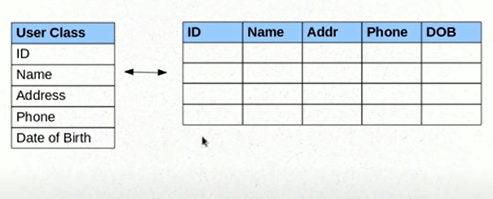
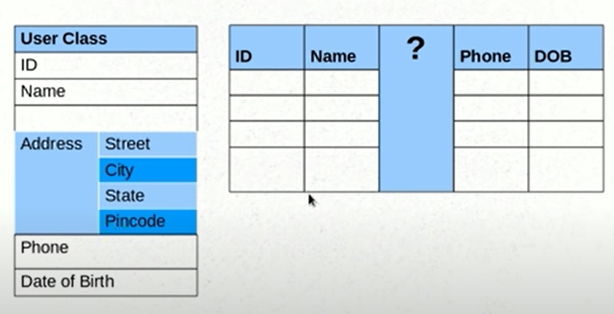
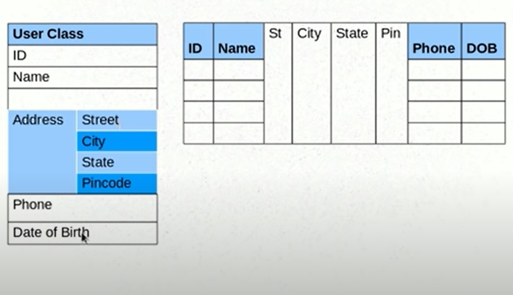
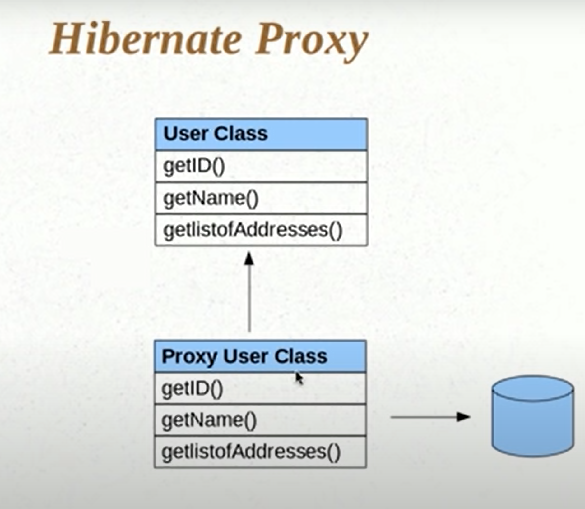
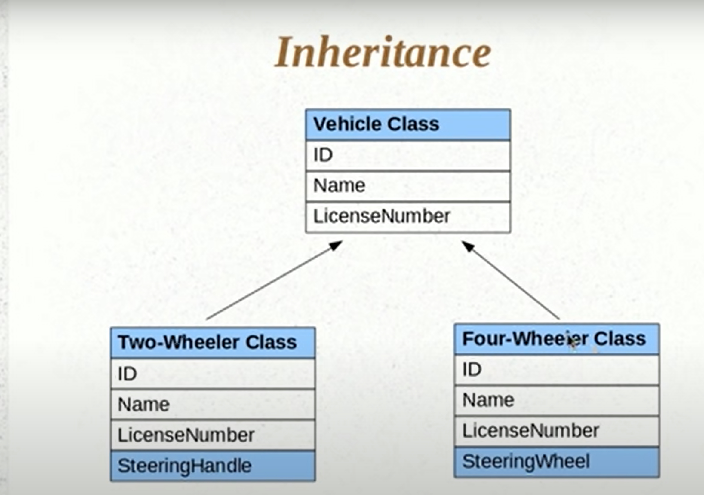
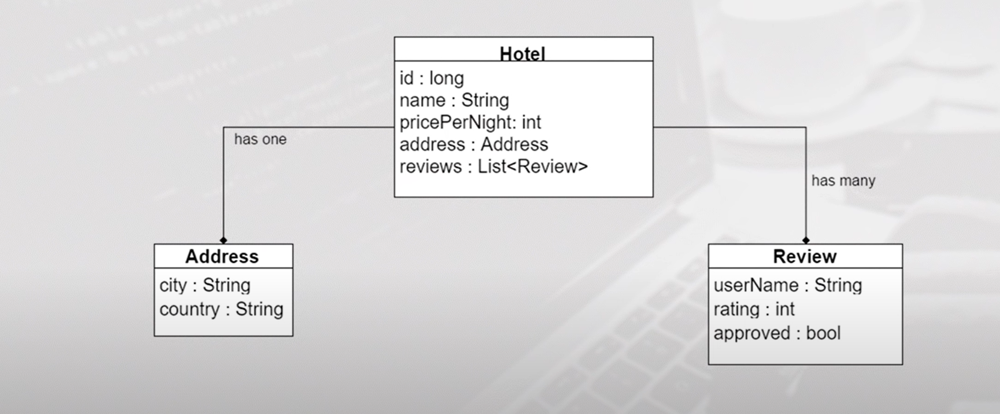

# Hibernate

 1. An ORM tool:
      * Problem with Database and code Object
         1. Mapping member variable to columns
         2. Mapping relationships
         3. Handling data types
         4. Managing changes to objet state
 2. Used in the data layer of applications
 3. Implements JPA

#### Saving Without Hibernate
1. JDBC Datbase configuration:
2. The Model  object
3. Service method to create the model object
4. Database design
5. DAO methods to save the object using SQL queries

#### Saving With Hibernate
1. JDBC Datbase configuration - Hibernate configuration
    * hibernate.cfg.xml
      * connection.driver_class: Database drive class name `org.postgresql.Driver`
      * connection.url: Datbase connection string `jdbc:postgresq;://localhost:5432/hibernateDb`
      * connection.username: Database username `postgres`
      * connection.password: Database password `postgres`
      * dialect: language with respect to query `org.hibernate.dialect.PostgreSQLDialect`
      * hbm2ddl.auto: creating/dropping  things if things are not exists `create`
      * mapping class : name of all the model related classes `UserDetals`
      * Second level cache `org.hibernate.cache.EhCacheProvider`
      * Enable/Disable: `cache.use_second_level_cache:true`
      * Enable Query Cache: `cache.use_query_cache:true`
  



1. The Model  object - Annotations
   *  JPA
      * @Entity : Class should treat as entity
        1. name: name of the table ie `@Entity(name="table_name") `
      * @Table:
        1. name: name of the table 
      * @Id : Primary key
      * @GeneratedValue : Auto Generate value for key
        1. strategy=GenerationType.Auto 
      * @Column:
        1.  name: Name of the column 
      * @Basic: It treated as field not column
        1. fetch:
        2. optional:
      * @Transient: Ignore it, ie not been persist
      * @Temporal: Ignore some value of filed 
        1. TemporalType.DATE : it ignore time from timestamp
      * @Lob : Large Object    
      * @Embeddable and @Embedded: Helps if one column has multiple sub column which will treated as individual column of same table
      * @AttributeOverride:
        1. name: embedded objects name
        2. column: value of the field which you want to override
      * @ElementCollection: Help for collection datatype and will create new table 
      * @JoinTable:
        1.  name 
        2.  joinColumns:@joinColumn(name="")
      * @ElementCollection:
        1. fetch = FetchType.eager ,
        2. 1. fetch = FetchType.lazy , by default it lazy 
      * @OneToOne: one table having foreign key which will the primary key of another (1 user having 1 vehicle)
      * @OneToMany: It will create new table has column which contain primary key of  parent map to  primary key of another as foreign key tables primary keys((1 user having 1many vehicle))
        1. mappedBy 
      * @ManyToOne:
      * @ManyToMany: It will create 2 new table has column which contain primary key of it(user) map to  primary key of another(vehicle)as foreign key tables primary keys. and another table vice-versa
        1. mappedBy 
      * @NotFound: Suppose it fail to make relationship 
        1. action=NotFoundAction.IGNORE 
      * @Inheritance: Added in parent class
        1. strategy = InheritanceType.SINGLE_TABLE 
      * @DiscriminatorColumn: This will change the DTYPE column name in inheritance ,used in parent class
        1. name:
        2. discriminatorTpe=DiscriminatorType.STRING 
      * @DiscriminatorValue(""): his will change the DTYPE column name in inheritance ,used in Child class
      * @NamedQuery: annotate in  entity class
         1. name = "UserDetails.byId"
         2. query = "from userDetails where userId = ?" 
      * @NamedNativeQuery: annotate in  entity class
         1. name = "UserDetails.byName"
         2. query = "select * from User_Details where username = ?" 
         3. resultClass = UserDetails.class
      * @Cacheable: Enabling Second level cache
      * @Cache:
         1.  usage=CacheConcurrencyStrategy.READ_ONLY
   * Hibernate
      * @GenericGenerator:
        1. name="hil-gen"
        2. strategy="hilo"
      * @CollectionId: 
         1. columns={@Column(name="")} 
         2. generator='hilo-gen'
         3. type=@Type(type='long')
      * @org.hibernate.annotations.Entity(selectBeforeUpdate=true) : It will fetch the data at ehe table with object in code compare it if it wont find any changes it avoid the update, if any changes found it will update

3. Service method to create the model object - use the Hibernate API(Annotation, HQL and Criteria)
   * Steps
     * Create a session factory , should be only one time in entire project
     * Create a session from the session factory
     * Use the session to save model objects
        ```java
            SessionFactory sessionFactory = new Configuration().configure.buildSessionFactory();// should be only one time in entire project

            // Adding Data to Database
            Session session = sessionFactory.openSession();
            session.beginTransaction();
            session.save(<name of object>);
            session.getTransaction().commit();
            session.close();

            // Fetching Data from Database
            Session session = sessionFactory.openSession();
            session.beginTransaction();
            obj = (type_cast)session.get(<name of object>.class,<primary key>); 
        ```
        
        ```java

            SessionFactory sessionFactory = new Configuration().configure.buildSessionFactory();// should be only one time in entire project

            // Lazy Initialization
            obj = null;
            Session session = sessionFactory.openSession();
            obj = (type_cast)session.get(<name of object>.class,<primary key>);// if the member variable as @ElementCollection annotation then ,At this movement it will use proxy object and fetch the info from db but don't return it
            obj.<method()>;// Here proxy method calls actual method and return the data 
        ```
        ```java

            SessionFactory sessionFactory = new Configuration().configure.buildSessionFactory();// should be only one time in entire project

            // Eager Initialization
            obj = null;
            Session session = sessionFactory.openSession();
            obj = (type_cast)session.get(<name of object>.class,<primary key>);// if the member variable as @ElementCollection(fetch = FetchType.eager) annotation then ,At this movement it will use proxy object and fetch the info from db and return it
            session.close();
            obj.<method()>;// Even if session is closed object can return the value since it got value in previous state itself
        ```
        One to one , one to many, many to one and many to many are the common relationship found in table, the relationship is specify with annotation
        ```java
            // Relation
        ``` 
        ```java  
            // Cascading
        ```
        
        If the inheritance info is not available then it will create a single table even after @Entity is specified in children which also contain properties of child along with DTYPE ie contians usually name of parent and child classname. 
        * Single Table Strategy, by default
        * Table per Class Strategy: Create table for child and parent, child class as extra column inherited from parent
        * Joined: parent table also contains info children, children contain children info along with parent ID as foreign key
        ```java
            // Inheritance
        ```

        ```java
            // CRUD Operation

            SessionFactory sessionFactory = new Configuration().configure.buildSessionFactory();// should be only one time in entire project

            // Create
            Session session = sessionFactory.openSession();
            session.beginTransaction();
            for(int i=o;i<10;i++>){
              UserDetails user = new UserDetails();
              user.setUserName("User " + i);
              session.save(user);
            }
            session.getTransaction().commit();
            session.close();

            // Read
            Session session = sessionFactory.openSession();
            session.beginTransaction();
            userDetails user =(userDetails) session.get(userDetails.class,6);
            session.getTransaction().commit();
            session.close();

            // Update
            Session session = sessionFactory.openSession();
            session.beginTransaction();
            userDetails user =(userDetails) session.get(userDetails.class,6);
            user.setUserName("Updated User");
            session.update(user);
            session.getTransaction().commit();
            session.close();

            // Delete
            Session session = sessionFactory.openSession();
            session.beginTransaction();
            userDetails user =(userDetails) session.get(userDetails.class,6);
            session.delete(user);
            session.getTransaction().commit();
            session.close();
        ```
        * The object before going to save is Transient Object, Once Transient object is saved then it become Persistance Object and  Hibernate track it ie once we save the object in db and again change the object in code its going to update it automatically, it is important that code should written inside session, once session is closed Hibernate wont track it. 
        * when we do session.delete() then object in persistance state will go to Transient state.
        * Once session is closed, then make changes in the object and open a session directly session.update() at this moment it will persist the change which we had made once session is closed ie detached stage.
        ```java
            // Transient Object and Persistance Object
            
            SessionFactory sessionFactory = new Configuration().configure.buildSessionFactory();// should be only one time in entire project

            userDetails user = new UserDetails();
            user.setUserName("Test User"); // user is Transient Object

            Session session = sessionFactory.openSession();
            session.beginTransaction();
            
            session.save(user); // user become persistance Object
            user.setUserName("Updated User"); // tracks the user change and update in DB so again save is not required
            user.setUserName("Updated User Again"); 
            
            session.getTransaction().commit();
            session.close(); // Tracking is stopped

            user.setUserName("Updated User After Session Close"); // Not get updated in db  
        ```
4. Database design - Not Need!
5. DAO methods to save the object using SQL queries - Not needed!


#### HQL(Hibernate Query Language)
 1. Create a query object : ```Query query = session.createQuery("select userName from UserDetails where userId > 5")```
 2. Execute query: ```List users = query.list()```
 3. Pagination: ```query.setFirstResult(5)```
 4. Supply value to the place-holder "?" or ":name" in query ie ```from UserDetails where userId > ?``` is ```query.setInteger(0, Integer.parseInt(minUserId))``` here 0 is position indicator ie  we have only one placeholder
 5. Named query: `Query query = session.getNamedQuery('UserDetails.byId')`
 6. Named native query: `Query query = session.getNamedQuery('UserDetails.byName')`


#### Criteria API
1. Create a criteria object: `Criteria criteria = session.createCriteria(UserDetails.class)`
2. Add Restriction to pull data ie kind of where clause: `criteria.add(Restrictions.eq("userName","User 10").add(Restrictions.gt("userId",5))`
3. Execute criteria  `List<UserDetails> users = (List<UserDetails> )criteria.list()`
4. Pagination `Criteria criteria = session.createCriteria(UserDetails.class).setProjection(Projections.property("UserId")).addOrder(Order.desc("userId")`
5. Query by Example: Hibernate ignores two things when it comes to Example ie  any of the property is null and property happens to primary key
  ```java
    SessionFactory sessionFactory = new Configuration().configure().buildSessionFactory();
    Session session = sessionFactory.openSession();
    session.beginTransaction();

    userDetails exampleUser = new UserDetails();
    exampleUser.setUserId(5);
    exampleUser.setUerName("user 5");

    Example example = Example.create(exampleUser);

    // Example example = Example.create(exampleUser).excludeProperty("userName");

    Criteria criteria = session.createCriteria(UserDetails.class)
                                  .add(example);

    List<UserDetails> users = (List<userDetails>) criteria.list();
    session.getTransaction().commit();
    session.close();
  ```  
#### Hibernate Cache
  1. First Level Cache - Session
  2. Second level cache
      * Across sessions in an application
      * Across applications
      * Across cluster
  3. Query cache 
      ```java
        SessionFactory sessionFactory = new Configuration().configure().buildSessionFactory();
        Session session1 = sessionFactory.openSession();
        session1.beginTransaction();

        // First Level Cache
        UserDetails user = (userDetails) session1.get(UserDetails.class, 1);
        UserDetails user2 = (userDetails) session1.get(UserDetails.class, 1);
        // Here only one time hibernate contact with database for second time ie user2 it intelligently identify that user cache  and assign to user2. if session is closed then firs level cache get deleted
        session1.getTransaction().commit();
        session1.close();


        // Second Level Cache
        Session session2 = sessionFactory.openSession();
        session2.beginTransaction();
        UserDetails user3 = (userDetails) session2.get(UserDetails.class, 1);
        session2.getTransaction().commit();
        session2.close();
        
        Session session3 = sessionFactory.openSession();
        UserDetails user4 = (userDetails) session3.get(UserDetails.class, 1);
        // if we are providing @cacheable and @cache annotation at Entity class then hibernate tries to get info from cache before querying the database
        session3.beginTransaction();
        session3.getTransaction().commit();
        session3.close();


        // Query Cache
        Session session4 = sessionFactory.openSession();
        session4.beginTransaction();
        Query query = session4.createQuery("from UserDetails user where user.userId=1");
        query.setCacheable(true);// checks if query cache has the value if not pull off the data from db and set the query cache
        List users = query.list();
        session4.getTransaction().commit();
        session4.close();

        Session session5 = sessionFactory.openSession();
        session5.beginTransaction();
        Query query2 = session5.createQuery("from UserDetails user where user.userId=1");
        query2.setCacheable(true); // fetch the data from query cache
        List users = query2.list();
        session5.getTransaction().commit();
        session5.close();
    ```  

## Spring Data JPA(Java Persistance API)
 1. Its a JPA(Java Persistance API) based ORM (Object Relational Mapping ) mainly used with Databases
 2. Annotation:
   
    1. @Entity: Tells that given class is structure of the database
        ```java
            @Entity
            public class Topic{
                -----------------
            }
        ```
    2. @Id: Helps for specifying the Key(primary key)
        ```java
            @Entity
            public class Topic{
            @Id
            private String id;
            private String name;
            private String description;
            }
        ```
            To make use of all crude operation available for that entity(database) create a interface which extends the CrudRepository from Data JPA

        ```java
            public interface TopicRepository extends CrudRepository<Topic, String>{
            }
        ```
            Here we are using 2 Generics ie
                Topic : This is Entity or database structure
                String : Datatype of the key ie primary key.

            we no need to write new crude operation, the instance of TopicRepository has some crude method

            if we are interested in declare any method in CrudRepository

        ```java
            
            public interface TopicRepository extends CrudRepository<Topic, String>{
                
                public List<Course> findByTopicId(String topicId)
            }
        ```

      3. @ManyToOne: Helps for specifying the foreign Key
    ```java
        @Entity
        public class Topic{
            @Id
            private String id;
            private String name;
            private String description;
            @ManyToOne
            private Topic topic
        }

    ```
    
     4. @Document(collection = "collection_name"): MongoDB or NoSql notation
    ```java
        @Document(collection = "Hotels")
        public class Hotel{
            @Id
            private String id;
            private String name;
            @Indexed(direction = IndexDirection.ASCENDING);
            private int pricePerNight;
            private Address address;
            private List<Review> reviews;
        }
    ```

    5. @Repository: Similar to JPA Repository
    (https://docs.spring.io/spring-data/mongodb/docs/current/reference/html/#repositories.query-methods.details)
    ```java
        @Repository
        public interface HotelRepository extends MongoRepository<Hotel, Strings>{
          Hotel findById(String id);
          List <Hotel> findByPricePerHighLessThan(int max)

          @Query(value = "{address.city:?0}")
          List <Hotel> findByCity(String city)

        }
       
    ```