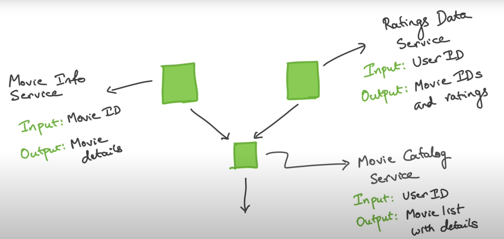
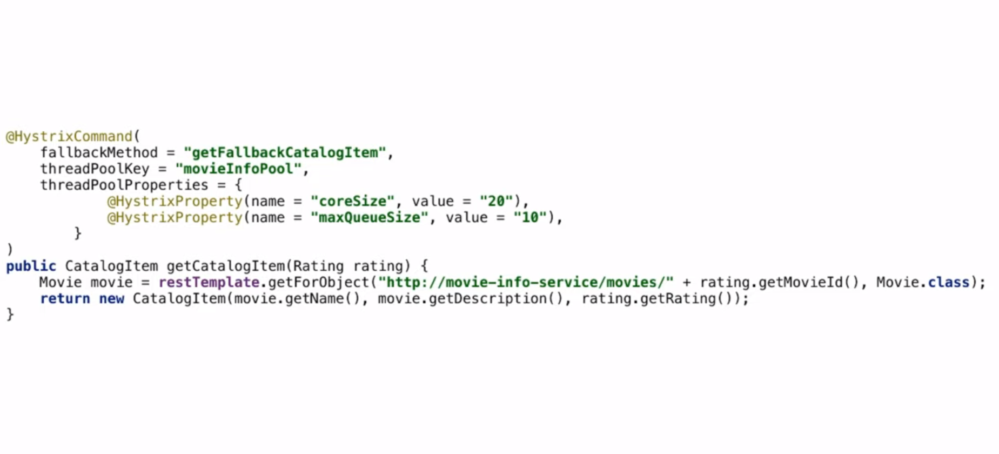

# Spring-Boot Microservice Basics

## Managing complexity within micto-service
 1. Patterns : Make microseervices work well togather Ex: Circuit breaker,Bulkhead
 2. Technologies : Libraries and frameworks to solve common problem Ex: Eureka,Ribbon,Hysterix,zuul

## Step 1: Basics
### Project Plan

 (https://github.com/koushikkothagal/spring-boot-microservices-workshop)
 1. Create 3 individual project ie movie_catalog_service, movie_info_sevice, movie_data_service 
 2. Call movie_info api from movie_catalog
     * How to make REST call from your code?
         * Calling REST APIs programatically
         * Usong REST client library
         * Spring Boot comes with a client already in your classpath - RestTemplate(deprecated ), webclient
           * RestTemplate 
                ```java 
                    @Autowired
                    RestTemplate restTEmplate
                    restTemplate.getForObjects(< url of REST server>,<Unmarshing classname>)
                ```
            * Webclient (it needs reactive type of programming ie asynchronous thing)
                ```java 
                    WebClient.Builder webClientBuilder = WebClient.builder();

                    webclientBuilder.build()
                                    .get()
                                    .uri(<url of REST server>)
                                    .retrieve()
                                    .bodyToMono(<Unmarshing classname>>)
                                    .block();

                ```
 3. Service Discovery
   * Client Side Service Discovery:
     * Start Up a Eureka server
        ```java 
            @SpringBootApplication
            @EnableEurekaServer
            public class DicoveryServerApplication {
                public static void main (String[] args){
                    SpringApplication.run(DiscoveryServerApplication.class, args)
                }
            }
        ```
        Evey Eureka server is itself a client,and trying to register itself,to stop this do following change
        ```applicaton.properties
            server.port=8761
            eureka.client.register-with-eureka=false
            eureka.clent.fetch-registry=false
        ```
     * Have Micro-Service register(public) using Eureka client 
        * Add some configuration in pom.xml of movie_catalog_service, movie_info_sevice, movie_data_service 
          * org.springframework.cloud:springboot-cloud-starte-netflix-client as dependency
          * spring-cloud.version as properties
          * Add repositories and dependency managemnt to it. 
          * Add Annotation as @EnableEurekaClient in main method .@value help for retrun values in application.properties
        ```applicaton.properties
            server.port=8082
            spring.application.name= movie-info-service
        ```
     * Have Micro-Service locate(consume) using Eureka client
        * Add annotation @LoadBalanced at movie_info_sevice where RestTemplate/Webclient.builder Bean created
        * Change url of RestClient/WebClient.Builder  to spring.application.name
          
   * Server side Service Discovery 

## Steps 2: Fault Tolereance and Resilience
### Issues with microservice
 1. Service goes down:
    * Run mutiple instances
 2. Microservice instance is slow:
    * Timeout-Threads
         ```java 
            @SpringBootApplication
            @EnableEurekaClient
            public class MovieCatalogServiceApplication {
                public static void main (String[] args){
                    SpringApplication.run(DiscoveryServerApplication.class, args)
                }

                @LoadBalanced
                @Bean
                public RestTemplate getRestTemplate(){
                    HttpComponentsClientH ttpRequestFactory clientHttpRequestFactory = new HttpComponentsClientHttpRequestFactory();
                    clienthttpRequestFactory.setConnectTimeout(3000);
                    return new RestTemplate(clientHttpRequestFactory);
                }
            }
        ```
### Circuit breaker(Hystrix)
   * Detect something is wrong
   * Take temporary steps to avoid the situation getting worse
   * Deactivate the "problem" component so that it doesn't affect downstream components
   * Parameter: 
     * What does the circuit trip?
       *  Last n requests to conside for the decision
       *  How many of those should fail?
       *  Timeout duration
      *  When does the circuit un-trip?
           *  How long after a circuit trip to try again? 

### Fallback
 * Types:
   * Throw an error
   * Return a fallback "default" response
   * Save previous responses(cache) and use that when possible
 * Benefits:
   * Failing Fast
   * Fallback Functionality
   * Automatic Recovery
  
### Hystrix
 *  Open source liv=brary originallly created by Netflix
 *  Implements circuit breaker pattern so you don't have to give it the configuration params ant it does the work
 *  Works well with Spring Boot
 *  Steps:-
    * Add the Maven spring-cloud-starter-netflix-hystrix dependency
    * Add @EnableCircuitBreaker to the applocation class
    * Add @HystrixCommand to methods that need cirxuit breakers
    * Configure Hystrix behavior
    * Ex: In movie_catalog_service

        * MovieCatalogServiceApplication.java
            ```java 
            @SpringBootApplication
            @EnableEurekaClient
            @EnableCircuitBreaker
            public class MovieCatalogServiceApplication {
                public static void main (String[] args){
                    SpringApplication.run(DiscoveryServerApplication.class, args)
                }

                @LoadBalanced
                @Bean
                public RestTemplate getRestTemplate(){
                    return new RestTemplate();
                }
            }
            ```
        * CatalogResource.java
            ```java
                @RestController
                @RequestMapping("/catalog")
                public class CatalogResource {

                    @Autowired
                    private RestTemplate restTemplate;

                    @Autowired
                    WebClient.Builder weClinetBuilder;

                    @RequestMapping("/{userId}")
                    @HystrixCommand(fallbackMethod = "getFallbackCatalog")
                    public List<catalogItem> getCatalog(@PathVariable("userId") String userId){
                        userRating userRating = restTemplate.getForObject("http://rating-data-service/ratungsdata.user" +userId,UserRating.class);
                        return userRating.getRatings().stream().map(rating -> {
                            Movie movie = restTemplate.getForObject("https://movie-info-service/movies/" + rating.getMovieId(),Movie.class);
                            return new CatalogItem(movie.getName(), movie.getDescription(), rating.getRating());
                        }).collect(Collectors.toList());
                    }

                    public List <CatalogItem> getFallbackCatalog(@PathVariable("userId") String userId){
                        return Arrays.aslist(new CatalogItem("No Movie","",0))
                    }
                }
            ```  
            OR
             ```java
                @RestController
                @RequestMapping("/catalog")
                public class CatalogResource {

                    @Autowired
                    private RestTemplate restTemplate;

                    @Autowired
                    WebClient.Builder webClinetBuilder;

                    @Autowired
                    MovieInfo movieInfo;

                    @Autowired
                    UserRatingInfo userRatingIngo;

                    @RequestMapping("/{userId}")
                    public List<catalogItem> getCatalog(@PathVariable("userId") String userId){
                        userRating userRating = userRatingInfo.getUserRating(userId;
                        return userRating.getRatings.stream().map(rating -> movieInfo.getCatalogItem(rating)).collect(Collectors.toList());
                    }
                }
            ``` 
            MovieInfo.java
            ```java
                @Service
                public class MovieInfo{
                    @Autowired
                    private RestTemplate restTemplate;

                    @HystrixCommand(fallbackMethod = "getFallbackCatalogItem")
                    public CatlogItem getCatalogItem(Rating rating){
                        Movie movie = restTemplate.getForObject("https://movie-info-service/movies/" + rating.getMovieId(),Movie.class);
                        return new CatalogItem(movie.getName(),movie.getDescription(),rating.getRating())
                    }

                    public CatalogItem getFallbacjCatalogItem(Rating rating){
                        return new CatalogItem("Movie name not found","",ratubg.getRating())
                    }
                }
            ``` 
            UserRatingInfo.java
            ```java
                @Service
                public classUserRatingInfo{
                    @Autowired
                    private RestTemplate restTemplate;

                    @HystrixCommand(fallbackMethod = "getFallbackUserRating")
                    public UserRating getuserRating(@PathVariable("userId")  String userId){
                        return restTemplate.getForObject("http://rating-data-service/ratungsdata.user" +userId,UserRating.class);
                        
                    }

                    public UserRating getFallbackUserRating(@PathVariable("userId")  String userId){
                        userRating userRating = new UserRating();
                        userRating.setUserId(userId);
                        userRating.setRatings(Arrays.asList(new Rating("0",0));
                        return userRating;
                    }
                }
            ``` 

 * Hystrix Dashboard
   * Add  dependencies in pom.xml ie, spring-cloud-starter-netflix-hystrix-dashboard, spring-boot-starter-actuator
   * Add annotation @EnableHystrixDashboard in main class ie MovieCatalogServiceApplication.java
   * Add this in application.properties management.endpoints.web.exposure.include=hystrix.stream
   * https://8081/hystrix

### Bulkhead


## Step 3: Microservice Configurations

### Exaple Configuration
 1. Database Connection
 2. Credentials
 3. Feature flags
 4. Business logic configuration parameters
 5. Scenario testing
 6. Spring Boot Configuration

### Goal
 1. Externalized(property files):
      * `@Value("${<key of application.property>}")`
        ```java
            @Value("${my.greeting}")
            private String greetingMessage; // value of application.properties
            @Value("${my.greeting : Default_value}")
            private String greetingMessage; // value of application.properties is not found then it will assign the default value
            @Value("some static message")
            private String staticMessage; //some static message
            @Value("${my.list.greeting}")
            private List<String>greetingMessage; // comma separate values comes as lists
            @Value("#{${my.list.greeting}}") // Evaluate expression
        ``` 
      * `@ConfigurationProperties(prefix of key of application.property>)`
         ```java
            @Configuration //Create a Bean
            @ConfigurationProperties
            pubic class DbSettings {
                private Map<String, String> connection;
                private String host;
                private int port;

                <Getters and Setters>
            }
        ```  
      * Once jar is created , add new application.properties in same path it will override existing properties
      * `java -jar <name_of_jar> --<property_name>=<property_value>`
 2. Environment specific(spring profiles):
     * Spring Profiles
       * If its not there default one get selected
       * Profile creation `application-<profileName>.extension`
       * Adding Profile to application.yml ie `spring.profiles.active:<profileName>`
       * `java -jar <name_of_jar> --spring.profiles.active=<profileName>`
       * `@Profile("<profileName>")` on Bean
     * Environment
       * ```java
            @Autowired
            private Environment env

            env.<methods>
         ``` 
 3. Consistent(spring cloud config server)
 4. Version history(Git repo source)
 5. Real-time management:
     * Should have spring cloud config server with client
     * Add dependency called org.springframework.boot:springboot-starter-actuator 
     * Add annotation @RefreshScope is resource of application ie controller class 
     * Call the Endpoint by post request- `http://localhost:<port>/actuator/refresh`

### YAML 
 1. It used to be Yet Another Markup Language, but now YAML Ain't Markup Language
 2. Syntax contains Key and Values
 3. Text by default takes as string ie no need of ""
   ```yml
    app:
        name: My app
        description: Welcome to ${app.name}

    my:
        greeting: Hello World
        list:
            value: One, Two, Three

    db:
        connection: "{connectionString: 'http://___', userName:'foo', password: 'pass'}"
        host: 127.0.0.1
        port: 1200

    management.endpoints.web.exposure.include: "*"
   ```
### Config as Service
 1. Apache Zookeeper
 2. ETCD - distributed key-value store
 3. Hashicorp Consul
 4. Spring Cloud Configuration Service:
      * Server 
        * Create springboot app with having atlesast one dependency as config-server ie org.springframework.cloud : spring-cloud-config-server
        * Add annotation @EnableConfigServer
        * `spring.cloud.config.server.git.uri=<repo>` in  application.properties , for local path `${HOME}/<path>` of config file
        * Usually cofiguration in config file applies to all client service. If your config should apply to specific microservice then your config file name is same as that of client microservice 
        * `https://localhost:<port>/<filename_without_extension>/profile` is checking for config values
      * Client
        * Add dependency  org.springframework.cloud : spring-cloud-stater-config
        * Add config-server url in microservice's application.properties ie, `spring.cloud.config.uri:http://localhost:8888` 

### Config Strategies
 1. Specificity: Microservice specific and Changing: No then go for Property files
 2. Specificity: Microservice specific and Changing: Yes then go for Config Server
 3. Specificity: Microservice specific and Type: Environment config then go for System variable with alias
   